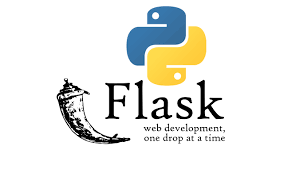
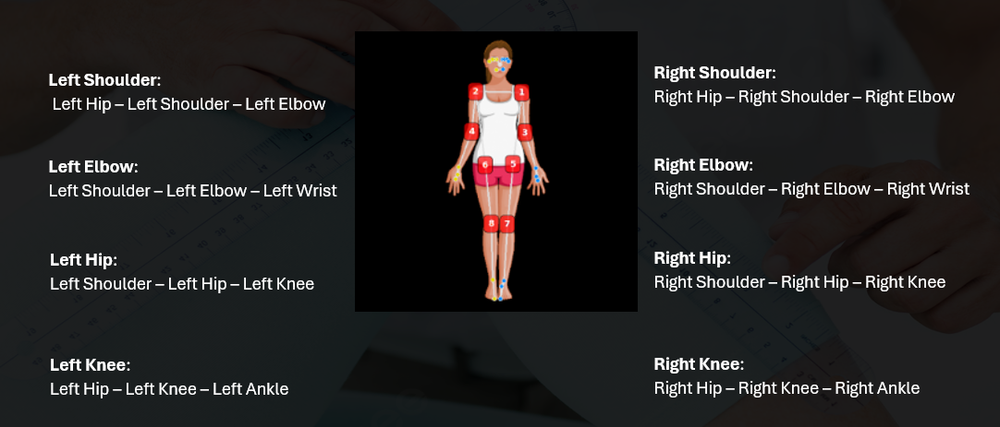
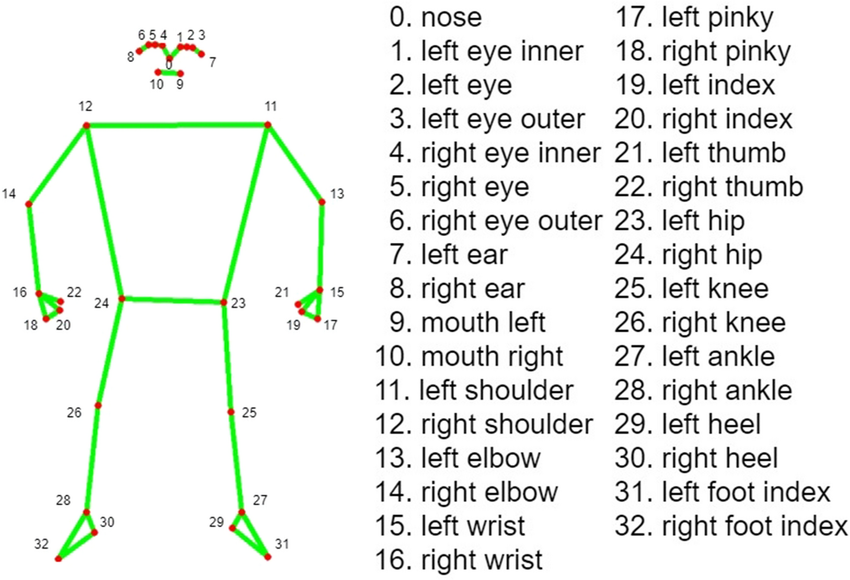
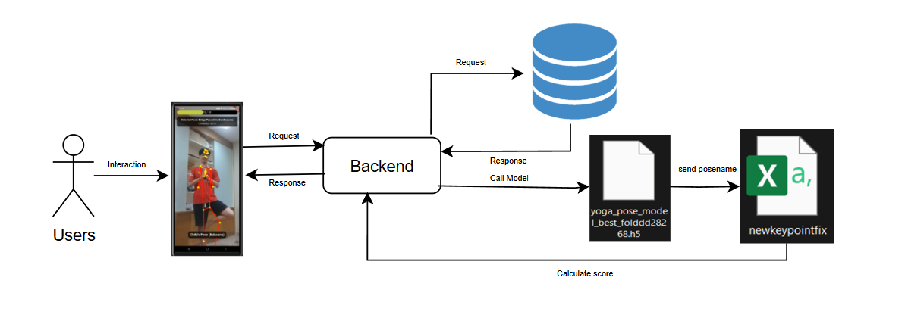
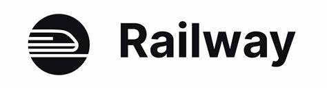

# 🧘‍♀️ Yoga Pose Evaluation System

<div align="center">
  
  
  
  
  
</div>

<div align="center">
  <h3>🚀 A real-time yoga pose evaluation and scoring system powered by Flask and deep learning</h3>
  <p><em>Transform your yoga practice with AI-powered pose analysis and gamified scoring!</em></p>
</div>

---

## 🌟 Project Overview

This innovative system leverages cutting-edge deep learning technology to analyze yoga poses in real-time, providing instant feedback and scoring to enhance your practice journey. Built with modern web technologies and deployed on the cloud for seamless accessibility.

### ✨ Key Highlights
- 🎯 **Real-time pose analysis** using advanced body keypoint detection
- 🏆 **Gamified scoring system** to motivate consistent practice
- 🧠 **Deep learning model** trained for accurate pose evaluation
- 🌐 **Cloud deployment** for global accessibility
- 📱 **Responsive design** works on any device

---

## 🔧 How It Works

### 1️⃣ **Backend Technology**
<div align="center">
  
</div>

- **Framework**: Python Flask - lightweight, fast, and perfect for ML inference
- **Model Location**: `uploads/yoga_pose_model_best_folddd28268.h5`
- **Architecture**: RESTful API design for seamless integration

### 2️⃣ **Pose Analysis Engine**

<div align="center">
  <table>
    <tr>
      <td align="center">
        
        <br>
        <strong>Joint Detection</strong>
      </td>
      <td align="center">
        
        <br>
        <strong>Body Keypoints</strong>
      </td>
    </tr>
  </table>
</div>

**Process Flow:**
1. 📸 **Capture** → Real-time pose detection from video/camera input
2. 🔍 **Analyze** → Extract body keypoints and joint positions
3. 🧠 **Evaluate** → Deep learning model assesses pose accuracy
4. 📊 **Score** → Calculate and award points for correct poses

### 3️⃣ **Intelligent Scoring System**

```
🎯 Pose Accuracy Assessment
    ↓
💯 Correct Pose Detected
    ↓
🏅 Yoga Score Calculation
    ↓
📈 Points Added to Total Score
    ↓
🎉 User Motivation & Engagement
```

### 4️⃣ **System Architecture**

<div align="center">
  
  <br>
  <em>Modular and scalable backend architecture</em>
</div>

**Architecture Benefits:**
- 🏗️ **Modular Design** - Easy maintenance and upgrades
- 🔄 **Scalable Infrastructure** - Handles multiple concurrent users
- 🛡️ **Secure Processing** - Safe handling of user data
- ⚡ **High Performance** - Optimized for real-time processing

---

## 🚀 Deployment

<div align="center">
  
  <br>
  <strong>Deployed on Railway Platform</strong>
</div>

### Why Railway?
- ⚡ **Instant Deployment** - Zero-config deployment
- 🌐 **Global CDN** - Fast worldwide access
- 📊 **Auto-scaling** - Handles traffic spikes automatically
- 🔒 **SSL Certificates** - Secure HTTPS connections

---

## 🎯 Features Overview

<div align="center">
  <table>
    <tr>
      <td align="center">
        <h3>🧘‍♂️</h3>
        <strong>Real-time Evaluation</strong>
        <p>Instant pose analysis and feedback</p>
      </td>
      <td align="center">
        <h3>🔍</h3>
        <strong>Precision Analysis</strong>
        <p>Advanced keypoint detection technology</p>
      </td>
      <td align="center">
        <h3>🏅</h3>
        <strong>Scoring System</strong>
        <p>Gamified experience to boost motivation</p>
      </td>
    </tr>
    <tr>
      <td align="center">
        <h3>🌐</h3>
        <strong>Cloud Hosted</strong>
        <p>Accessible anywhere, anytime</p>
      </td>
      <td align="center">
        <h3>📱</h3>
        <strong>Cross-platform</strong>
        <p>Works on desktop and mobile devices</p>
      </td>
      <td align="center">
        <h3>🚀</h3>
        <strong>Fast & Reliable</strong>
        <p>Optimized for smooth performance</p>
      </td>
    </tr>
  </table>
</div>

---

## 🛠️ Technical Stack

<div align="center">
  <table>
    <tr>
      <td><strong>Backend</strong></td>
      <td>Python Flask, TensorFlow/Keras</td>
    </tr>
    <tr>
      <td><strong>Machine Learning</strong></td>
      <td>Deep Learning Model (H5 format)</td>
    </tr>
    <tr>
      <td><strong>Computer Vision</strong></td>
      <td>Body Keypoint Detection</td>
    </tr>
    <tr>
      <td><strong>Deployment</strong></td>
      <td>Railway Platform</td>
    </tr>
    <tr>
      <td><strong>API</strong></td>
      <td>RESTful Architecture</td>
    </tr>
  </table>
</div>

---

## 🏃‍♀️ Getting Started

### Prerequisites
- Python 3.8+
- TensorFlow 2.0+
- Flask 2.0+
- OpenCV (for image processing)

### Quick Start
```bash
# Clone the repository
git clone https://github.com/yourusername/yoga-pose-evaluation.git

# Install dependencies
pip install -r requirements.txt

# Run the application
python app.py
```

---

## 🎨 Demo & Screenshots

> Add your demo GIFs and screenshots here to showcase the system in action!

---

## 🤝 Contributing

We welcome contributions! Please feel free to submit a Pull Request. For major changes, please open an issue first to discuss what you would like to change.

---

## 📄 License

This project is licensed under the MIT License - see the [LICENSE](LICENSE) file for details.

---

<div align="center">
  <h3>🌟 Star this repository if you found it helpful!</h3>
  <p>Made with ❤️ for the yoga community</p>
  
  <a href="#top">⬆️ Back to Top</a>
</div>

---

**Happy Yoga Practice! 🧘‍♀️✨**